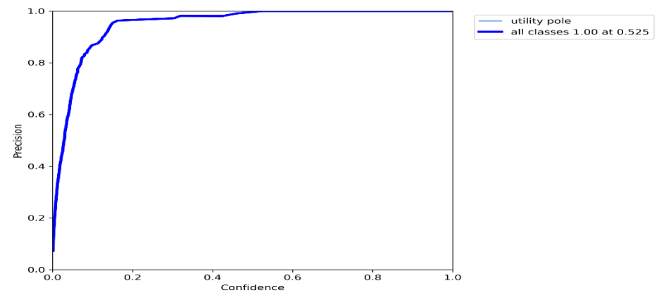
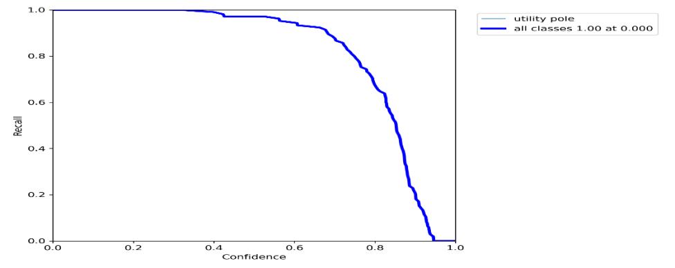
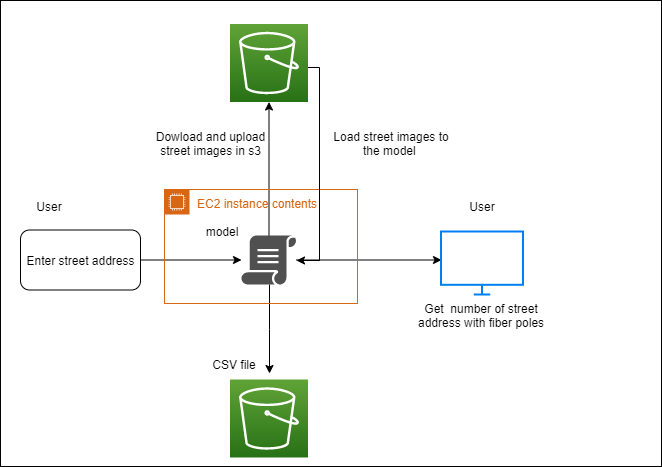

# Streetview-Fibre-pole-detection-
### Team Member
- Odiodio Osigbemhe Oshiozekhai - Team Lead 
- Michael Nthome Kihara - Admistrative lead
- Humphery Osas Ojo- Tech Lead
- Basheer Ashafa - Assistant Tech Lead
- Godwin Efugha Chibuikem -  Assistant Team Lead

# Summary
This project was focused on utilizing deep learning algorithm to automatically detect fibre pole and its location in images gotten from google streetview  app. This approached was aimed at reducing the cost, time and labor involved in manually mapping utility poles for deploying 5g equipment.
### Brief Overview
- Three object detection model were consider during the course of the project (yolov7, mask R cnn, EfficientDet)
- Images collected from google streetview app and mobile phones were labelled and augmented using Roboflow and Makesense Ai to train the models.
- Yolov7 model performed the best, it has a fast inference rate(5fps to 160fps) than other object detection model considered during this project
- This solution was deployed to streamlit for easy access and utilitization
## Data collection
273 images of utility poles were initially obtained from Roboflow in COCO format and few images using mobile phone. Several image pre-processing and augmentation steps, including adding disturbances to images and reproducing greyscale versions of images, were applied to the dataset to provide for more learning adaptation for the model.  This then resulted in a total of 501 images for the new dataset. The dataset was  then split into the train, test, and valid subsets, which contained 351, 50, and 100  images, respectively. This dataset was imported for the model training on  Google Colab via the Roboflow API key which was obtained from the platform. 
## Model Training
Our training model relies on the Yolov7 pre-trained model, which we obtained from the official YOLOV7 GitHub repository (https://github.com/WongKinYiu/yolov7). The model was Trained with the 501 images obtained from Roboflow with 100 epochs and obtained the below results in a time frame of 32 minutes.

Precision of 1.00 @0.525 confidence level

Recall of 1.00 @0.00 confidence level \
From the above images, our model can  attain a precision of 1.00 at a confidence level of 0.525 and a recall of 0.99 when the confidence is 0.4
## Google street view imagery:
Our solution utilizes street view images obtained via  google Application Programming Interface (API). Two methods are adopted for street sampling- the first method utilizes a function that accepts a single address or multiple street addresses  and  downloads the 00, 900, 1800,  and  2700 views of the street or streets to form a complete panoramic view of the street and then parses the images to the algorithm to detect the presence of utility poles on the street. The second method utilizes a function that accepts a region, maps it to a polygon with a set number of  sample points (number of coordinates), and downloads several images at each sampling point (Dwyer, 2022). Depending on the number of sampling points specified, this will give an overall estimate of how many poles 
are in the selected region. Location coordinates are obtained by utilizing the Python package “Nominatim,” which converts a string of an address to the corresponding coordinates. From our explanation above, the coordinates obtained are then parsed to the function  that downloads images for each coordinate.
### Sample Images of Fibre pole detection
  \
The first image(from left to right) is a streetview image depicting a moving car, three fibre poles , two distant light pole and a university gate before object detection while the second image is the same image with which has been inferenced by the model. 
## Deployment
Our team has deployed a user-friendly solution as a web application using Streamlit as the framework. The application is hosted on an AWS EC2 T3 medium instance of 8GB memory to ensure optimal availability. The Street-View images downloaded during detection are sent to the S3 bucket. Whenever an  already detected address is imputed, the images and results are immediately called from the s3 bucket without the need to re-download the images (Dwyer, 2022).\

